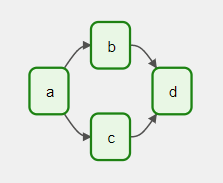
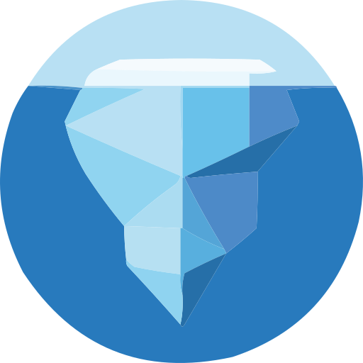
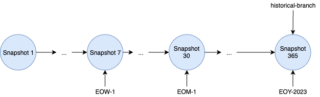
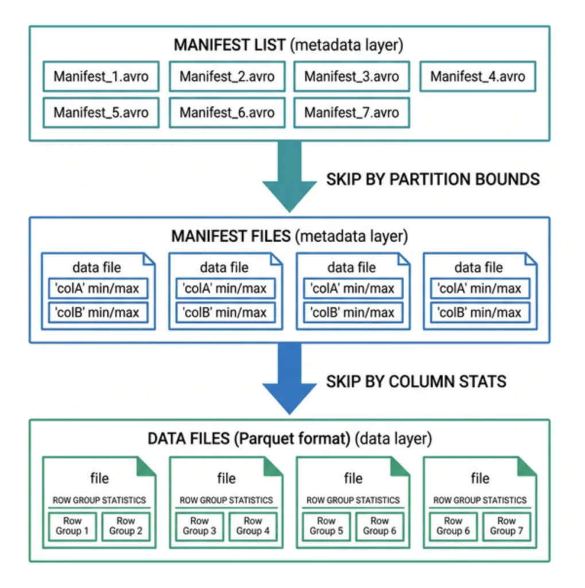
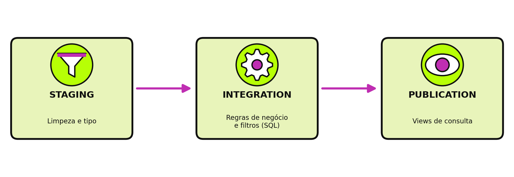
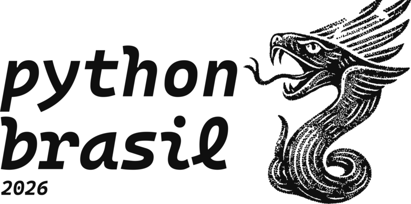

<!-- _class: capa light -->
<!-- _paginate: false -->
<!-- _footer: "" -->

<div class="selo">14 a 19<br>de outubro<br>de 2026<br>{Floripa/SC}</div>

# O Iceberg Foi pro Snowflake

Do monolito com Apache Iceberg ao Snowflake

**Gabu Bellon** · @gabubellon

---

<!-- _class: frase light -->

# O design destes slides teve apoio de IA.

O conteúdo técnico é todo do palestrante.
As imagens são de banco de imagens 

---

<!-- _class: palestrante light -->

<style scoped>
img { border-radius: 165px; }
</style>


# Gabu Bellon

### Lead Data Engineer · phData · @gabubellon

- Pronomes: Nenhum / Ele / Dele
- Nerd/Geek e pai da Ceci
- Entusiasta de Comunidade de Dados
- Pythonista e Conselheiro da APyB

---

<!-- _class: cartoes light -->

## Uma Jornada em Três Gerações

1. **Monólito** Apache Iceberg
2. **Warehouse** Snowflake e dbt
3. **Batch** Airflow + Kubernetes

<!--
- Nenhuma geração substitui a anterior de uma vez: as três convivem durante a migração.
- Migração feed a feed, com corte controlado, sem big-bang.
-->

---

<!-- _class: numeros light -->

## A Plataforma de Dados

- **30+** fontes de dados de fornecedores do mercado financeiro
- **50+** DAGs em produção
- **3** gerações de arquitetura convivendo

<!--
- A plataforma consolida preços, índices, derivativos e referências do mercado financeiro.
-->

---

<!-- _class: destaque light -->

## <div align=center>Funcionar <br>X Escalabilidade</div>

- Crescimento X Governança X Manutenção
- Melhor Arqutetura X Arquitetura Que Entrega
- Solução Perfeita x Solução Necessária

---

<!-- _class: secao light -->
<!-- _paginate: false -->
<!-- _footer: "" -->

# _01_ Ferramentas

<!--
- Como tudo começou: o monólito Apache Iceberg.
-->

---

<!-- _class: cartoes light fig-dir -->

<style scoped>
section { --fig: url("img/figurinhas/mago.png"); --fig-rot: 9deg; }
</style>


## Apache Airflow

1. **O que é** Orquestrador de Rotinas Agendados (DAG)
2. **Como funciona** Cada fluxo é uma DAG em código Python.
3. **No dia a dia** Permite centraliza a execução de rotinas e pipeline de dados 

---
<!-- _class: light -->

## Apache Airflow

```python
from datetime import datetime
from airflow.decorators import dag
import airflow.operators.empty.EmptyOperator
@dag(   start_date=datetime(2021, 1, 1), 
        schedule="@daily")
def meu_dag():
    a, b, c, d = [
            EmptyOperator(task_id=t) 
            for t in "abcd"
        ]
    a >> [b, c] >> d
meu_dag()
```



<!--
- Uma DAG (grafo acíclico dirigido) reúne tarefas com dependências e relações que dizem como rodam.
- Aqui ela é declarada com o decorador @dag; também dá com `with DAG(...)` ou o construtor.
- O operador >> define a dependência: a roda antes; b e c rodam depois dela; d só roda quando as duas terminam.
- Diagrama da documentação oficial do Apache Airflow 2.5.2 (Core Concepts > DAGs), Apache License 2.0.
- Cada execução cria uma nova instância da DAG, chamada DAG Run; schedule="@daily" roda uma por dia.
- Fonte: documentação do Airflow 2.5.2, Core Concepts > DAGs.
- https://airflow.apache.org/docs/apache-airflow/2.5.2/core-concepts/dags.html
-->

---

<!-- _class: cartoes light fig-esq -->

<style scoped>
section { --fig: url("img/figurinhas/mago-ola.png"); --fig-rot: 8deg; }
</style>


## Snowflake

1. **O que é** Data warehouse gerenciado, na nuvem.
2. **Diferencial** Separa armazenamento e processamento.
3. **No dia a dia** Consultas em SQL, sem cuidar de servidor.

---
<!-- _class: light -->

## Snowflake


---


<!-- _class: cartoes light fig-dir -->

<style scoped>
section { --fig: url("img/figurinhas/bruxa.png"); --fig-rot: -7deg; }
</style>


## dbt

1. **O que é** Solução de Ambiente de Dados Completa na nuvem
2. **Como organiza** Banco de dados, Ferramentes de Dados (Stream,Acesso)
3. **No dia a dia** Ambinte de dispobilização e analise de dados

---

<!-- _class: light -->

## DBT

```yml
version: 2
models:
  - name: pedidos
    description: Pedidos
    columns:
      - name: id
        tests: [unique]
```


---

<!-- _class: cartoes light fig-esq -->

<style scoped>
section { --fig: url("img/figurinhas/bruxa.png"); --fig-rot: -12deg; }
</style>



## Apache Iceberg

1. **O que é** Formato de tabela para arquivos de dados.
2. **Pra que serve** Traz transação e versão pros arquivos.
3. **No dia a dia** Cada commit vira um snapshot: dá pra voltar no tempo.

---

<!-- _class: light -->
<!-- _paginate: true -->

## Apache Iceberg


---

<!-- _class: fluxo-vertical light -->
<!-- _paginate: true -->


## Catálogo e Metadata

1. Catálogo/Metadata
2. Schema/Snapshot
3. Manifest
4. Dados

<!--
- O catálogo guarda só um ponteiro: qual metadata file é o atual de cada tabela.
- Metadata layer: metadata file (schema, snapshots) → manifest list → manifest files.
- Manifest files apontam os arquivos de dados reais (data layer).
- Estrutura descrita na especificação oficial do Apache Iceberg (iceberg.apache.org/spec).
-->

---
<!-- _class: light -->
## Histórico de Snapshots

<div class="nota-flutuante dir">
<strong>Snapshots</strong><br>Cada commit vira um snapshot novo: dá pra marcar (tags) e voltar no tempo.
</div>



<!--
- Cada commit do Iceberg vira um snapshot novo na linha do tempo.
- Dá pra marcar snapshots importantes (tags) e guardar por um tempo, pra auditoria ou retenção.
- Diagrama da documentação oficial do Apache Iceberg (iceberg.apache.org/docs/latest/branching), Apache License 2.0.
-->

---
<!-- _class: light -->
## Particionamento

<div class="nota-flutuante dir">
<strong>Particionamento</strong><br>é dinamico porque é gerenciado diretamente no dado
</div>



<!--
- Cada commit do Iceberg vira um snapshot novo na linha do tempo.
- Dá pra marcar snapshots importantes (tags) e guardar por um tempo, pra auditoria ou retenção.
- Diagrama da documentação oficial do Apache Iceberg (iceberg.apache.org/docs/latest/branching), Apache License 2.0.
-->

---

<!-- _class: light logo-tr -->

<style scoped>
section { --logo: url("img/logos/apache-iceberg.png"); }
</style>

## Manifest: o Ponteiro pros Dados

```json
{
  "status": 1,
  "snapshot_id": 8744736658442914487,
  "data_file": {
    "file_path": "s3://bucket/data/00000.parquet",
    "partition": {"data_pedido_day": 20468},
    "record_count": 1000
  }
}
```

<!--
- Cada linha do manifest aponta um arquivo de dados (data_file.file_path), com métricas como record_count.
- Exemplo simplificado e com valores inventados; no disco o manifest é um arquivo Avro, aqui mostrado em JSON.
- status: 0 é arquivo existente, 1 é adicionado, 2 é removido.
- Um manifest real tem mais campos (partição, tamanho do arquivo, limites de coluna); veja a especificação em iceberg.apache.org/spec.
-->

---

<!-- _class: light logo-tr -->


<style scoped>
table { width: 100%; table-layout: fixed; font-size: 22px; }
th, td { padding: 6px 10px; word-wrap: break-word; }
</style>

## Como Acessar o Catálogo

| Catálogo | Implementação |
|---|---|
| Python  | Code (PyIceberg e Polars) |
  Engine  | Code and SaaS (Spark, Flink, Trino, DuckDB e Snowflake) |
| REST Catalog | Code ou SaaS (Snowflake,Polaris, Unity Catalog, Tabular |
| Hive Catalog | Code |
| AWS Glue | SaaS |
| JDBC Catalog | SaaS |
| Nessie Catalog | Code |
| Hadoop Catalog | Code |

<!--
- Catálogos suportados pelo Apache Iceberg (iceberg.apache.org/docs/latest).
- HadoopCatalog não implementa rename de tabela e depende de rename atômico do filesystem — por isso é arriscado em object stores como S3.
- "Na mão" é só a infraestrutura: você sobe e mantém o serviço. "Gerenciado" é alguém cuidando disso por você.
- Lista parcial: a documentação lista bem mais engines (iceberg.apache.org/multi-engine-support).
- Polaris, Unity Catalog e Tabular implementam o protocolo REST Catalog da especificação Iceberg.
-->

---

<!-- _class: light logo-tr -->

<style scoped>
section { --logo: url("img/logos/python.png"); }
</style>

## PyIceberg

```python
from pyiceberg.catalog import load_catalog

catalog = load_catalog(
    "meu", type="rest", uri="https://catalogo.exemplo.com"
)
tabela = catalog.load_table("vendas.pedidos")
df = tabela.scan().to_pandas()
```

<!--
- Exemplo genérico: troque o nome do catálogo, a URI e a tabela pelos seus.
- type="rest" vale para catálogos que seguem o protocolo REST Catalog; Glue, Hive e outros usam outro type.
- A credencial normalmente vai na configuração do PyIceberg ou em variáveis de ambiente.
-->

---

<!-- _class: light logo-tr -->

<style scoped>
section { --logo: url("img/logos/python.png"); }
</style>

## PyIceberg: Disco Local

```python
from pyiceberg.catalog import load_catalog

catalog = load_catalog(
    "local", type="sql",
    uri="sqlite:///catalogo.db",
    warehouse="file:///dados/warehouse",
)
tabela = catalog.load_table("vendas.pedidos")
```

<!--
- Exemplo genérico: o catálogo é um arquivo SQLite e os dados ficam numa pasta do disco, sem servidor e sem URL.
- Troque os caminhos pelos seus; o warehouse usa o esquema file://.
- Para ler uma tabela direto de um arquivo de metadata, sem catálogo, existe StaticTable.from_metadata("/caminho/metadata/v1.metadata.json").
-->

---

<!-- _class: light logo-tr -->

<style scoped>
section { --logo: url("img/logos/apache-iceberg.png"); }
</style>

## Spark

```python
spark = (SparkSession.builder
  .config("spark.sql.catalog.meu",
          "org.apache.iceberg.spark.SparkCatalog")
  .config("spark.sql.catalog.meu.type", "rest")
  .config("spark.sql.catalog.meu.uri", URI)
  .getOrCreate())
spark.sql("SELECT * FROM meu.vendas.pedidos")
```

<!--
- Exemplo genérico: URI é o endereço do seu catálogo REST.
- Precisa do JAR iceberg-spark-runtime no classpath da sessão.
- O nome "meu" depois de spark.sql.catalog. é o nome do catálogo nas consultas.
-->

---

<!-- _class: light logo-tr -->

<style scoped>
section { --logo: url("img/logos/apache-iceberg.png"); }
</style>

## DuckDB

```sql
INSTALL iceberg;
LOAD iceberg;
ATTACH 'warehouse' AS meu (
  TYPE iceberg, ENDPOINT 'https://catalogo.exemplo.com'
);
SELECT * FROM meu.vendas.pedidos;
```

<!--
- Exemplo genérico: troque o endpoint e o nome do warehouse pelos seus.
- Normalmente precisa de um CREATE SECRET com as credenciais; a sintaxe depende da versão do DuckDB.
-->

---

<!-- _class: light logo-tr -->

<style scoped>
section { --logo: url("img/logos/apache-iceberg.png"); }
</style>

## Trino

```properties
# etc/catalog/meu.properties
connector.name=iceberg
iceberg.catalog.type=rest
iceberg.rest-catalog.uri=https://catalogo.exemplo.com
```

```sql
SELECT * FROM meu.vendas.pedidos;
```

<!--
- No Trino o catálogo é um arquivo .properties; o nome do arquivo vira o nome do catálogo.
- Exemplo genérico: troque a URI pela do seu catálogo REST.
-->

---

<!-- _class: light logo-tr -->

<style scoped>
section { --logo: url("img/logos/snowflake.png"); }
</style>

## Snowflake: Catalog Integration

```sql
CREATE CATALOG INTEGRATION meu_catalogo
  CATALOG_SOURCE = ICEBERG_REST
  TABLE_FORMAT = ICEBERG
  CATALOG_NAMESPACE = 'vendas'
  REST_CONFIG = (CATALOG_URI = 'https://exemplo.com/api')
  ENABLED = TRUE;
```

<!--
- Exemplo genérico, sem a autenticação (REST_AUTHENTICATION, com OAuth); confira os parâmetros na documentação do Snowflake.
- Depois: CREATE ICEBERG TABLE pedidos CATALOG = 'meu_catalogo' EXTERNAL_VOLUME = 'meu_volume' CATALOG_TABLE_NAME = 'pedidos';
- O Snowflake lê a tabela; quem a gerencia continua sendo o catálogo externo.
-->

---

<!-- _class: secao light -->
<!-- _paginate: false -->
<!-- _footer: "" -->

# _02_ Monólito Iceberg

<!--
- Como tudo começou: o monólito Apache Iceberg.
-->

---

<!-- _class: light -->

<style scoped>
section { justify-content: center; align-items: center; }
img:not([alt~="bg"]) { display: block; margin: 0 auto; }
</style>


<!--
- O monólito: um sistema só, em Python, concentrando o fluxo de ponta a ponta.
- Imagem de fundo em retrato: o Marp corta as bordas para preencher o slide.
-->

---

<!-- _class: fluxo light logo-br -->

## Fluxo Legado

1. SFTP/API
2. Airflow
3. Builders em Python (INSERT/UPDATE)
4. Commit no Iceberg
   
```python
@DataLakeTable(
    dataset="precos",
    name="fechamento",
)
def build(procdate):
    ...
```

<!--
- Airflow dispara o main_*.py; execução manual: python main_.py --procdate YYYYMMDD.
- Builders em jgdata/datasets/ transformam os dados.
- initDataset() decide se precisa rodar backfill, via executeBuild().
- O commit no Iceberg vira um snapshot.
- @DataLakeCache e @DataLakeTable registram o builder no SchemaRegistry.
- FileLock em /var/tmp/iceberg/{table} serializa as escritas do Spark.
-->

---

<!-- _class: light -->
## Catálogo Rígido 

* <span class="circulo">S3 -> Local</span> virtual
* PySpark <span class="circulo">UM NÓ</span> por execução
* Manifesto com Caminho <span class="circulo">RÍGIDO</span> (/home/xpto/file.parquet)
* <span class="circulo">UPDATE</span> em Partições
<br>
<div align=center>
<mark>ANTI-PATTERN</mark>
</div>


---

<!-- _class: secao light -->
<!-- _paginate: false -->
<!-- _footer: "" -->

# _03_ Snowflake e DBT

<!--
- Snowflake, dbt e o Datapipe.
-->

---

<!-- _class: light -->

## Da pra retulizar ?

```sql
CREATE EXTERNAL VOLUME meu_volume
  STORAGE_LOCATIONS = ((
    NAME = 's3_vendas'
    STORAGE_PROVIDER = 'S3'
    STORAGE_BASE_URL = 's3://meu-bucket/vendas/'
    STORAGE_AWS_ROLE_ARN = 'arn:aws:iam::123456789012:role/sf'
  ));

CREATE ICEBERG TABLE pedidos
  EXTERNAL_VOLUME = 'meu_volume'
  CATALOG = 'meu_catalogo'
  METADATA_FILE_PATH = 'pedidos/metadata/v1.metadata.json';

SELECT * FROM pedidos;
```
---

<!-- _class: cartoes light -->

## Da pra retulizar ?

1. **Caminho Relativo** Manifestos Rigidos
2. **Catálgo Dinâmico** Gerado a cada Carga
3. **Volume de Dados** Carga Histórica

<br>
<div>
<mark>NÃO FORAM SEGUIDAS BOAS PRÁTICAS DE ARQUITETURA</mark>
</div>

---

<!-- _class: light -->

## Solução


---

## Nova Arquitetura

<!-- _class: cartoes light -->

1. **Reaproveitamento** Dados Raw Históricos (local/s3)
2. **Framework Novo** Airflow K8S+ DBT + Snowflake
3. **Pipeline Batch** RAW -> STAGE -> INTEG -> PROD

---

<!-- _class: light -->

## Ingestão em Lote


<!--
- Mesma ideia do slide anterior, em diagrama.
- A ingestão ainda não conhece o Snowflake.
-->

---
<!-- _class: cartoes light -->
## Camadas no DBT

1. **STAGING** Limpeza e Tipo
2. **INTEGRATION** Regras Negócios e Fitros (SQL)
3. **PUBLICATION** Views de Consultas

<!--
- Consumidores só leem publication, nunca RAW diretamente.
- sources/*.yml liga os models às tabelas RAW.
-->

---

<!-- _class: light -->

## Camadas do dbt



<!--
- Mesma ideia do slide anterior, em diagrama.
- Consumidores só leem publication, nunca RAW diretamente.
-->

---

<!-- _class: light -->

## Orquestração: Airflow + Kubernetes


<!--
- Mesma ideia do slide anterior, em diagrama.
- As tags do dbt ligam cada dataset à sua DAG, ex. +tag:ice_mft_futures+.
-->

---

4<!-- _class: light -->

## O Iceberg derreteu


<!--
- Versão em diagrama do slide anterior, para comparar.
- As tags do dbt ligam cada dataset à sua DAG, ex. +tag:ice_mft_futures+.
-->

---

<!-- _class: secao light -->
<!-- _paginate: false -->
<!-- _footer: "" -->

# _04_ Enxugando Gelo

<!--
- Snowflake, dbt e o Datapipe.
-->

---

<!-- _class: light -->


<style scoped>
section { justify-content: center; }
section p { font-size: 46px; line-height: 1.3; }
</style>

## Iceberg é bom

Sem boas práticas, 
vira <mark>um monte de gelo</mark>.

<!--
- Arquitetura: Técnica x Negócios.
-->

---

<!-- _class: light -->


<style scoped>
section { justify-content: center; }
section p { font-size: 46px; line-height: 1.3; }
</style>

## Segurança x Reuso

Governança sem controle 
<mark>não escala</mark>.

<!--
- Arquitetura: Técnica x Negócios.
-->

---

<!-- _class: light -->


<style scoped>
section { justify-content: center; }
section p { font-size: 46px; line-height: 1.3; }
</style>

## Legado x Lenda

Aprender com o passado, 
<mark>sem repetir seus erros</mark>.

<!--
- Arquitetura: Técnica x Negócios.
-->

---

<!-- _class: encerramento light -->
<!-- _paginate: false -->
<!-- _footer: "" -->

# Perguntas?

**Gabu Bellon**
_@gabubellon_
_bllon.co_


Slides

<!--
- Gerar o QR code real: uv run scripts/qr.py https://bllon.co (troca img/qr.png).
-->

---

<!-- _class: secao light -->
<!-- _paginate: false -->
<!-- _footer: "" -->

# Extra

<!--
- Slides de apoio, caso dê tempo ou surjam perguntas sobre catálogos.
-->

---

<!-- _class: light logo-tr -->

<style scoped>
table { width: 100%; table-layout: fixed; font-size: 22px; }
th, td { padding: 6px 10px; word-wrap: break-word; }
</style>

## Qual Catálogo Usar?

| Catálogo | Prós | Contras | Produção |
|---|---|---|---|
| REST | Padrão aberto, portável | Precisa de um serviço | Recomendado |
| Glue / DynamoDB | Gerenciado na AWS | Preso à AWS | Recomendado (AWS) |
| JDBC | Usa banco já existente | Menos padrão que o REST | Recomendado |
| Nessie | Branch e auditoria | Mais uma peça pra operar | P/ governança |
| Hive | Reaproveita metastore | Prende ao Hive | Ok se já tem Hive |
| Hadoop | Simples, só filesystem | Exige rename atômico | <mark>Não recomendado</mark> |

<!--
- HadoopCatalog não suporta rename de tabela e exige rename atômico do filesystem: evite em object stores como S3.
- REST Catalog é hoje o protocolo padrão da comunidade Iceberg, por isso costuma ser a escolha mais segura.
-->

---

<!-- _class: light logo-tr -->

## Preprocess com Polars

```python
Column(
    name_in_file="PRECO",
    name_in_snowflake="preco",
    snowflake_type=SnowflakeTyping.FLOAT,
    polars_type=PolarsTyping.FLOAT,
)
```

<!--
- CsvReader (lazy) → transforma → Parquet.
- orchestrate_preprocess usa SCHEMA_BY_DATASET para tipar cada coluna.
-->


---

<!-- _class: figurinhas light -->
<!-- _paginate: false -->
<!-- _footer: "" -->

## Figurinhas

### Dazumbanho! Chegasse ao fim, ixtepô!

    

 <span class="circulo">olha aqui</span> <mark>marca-texto</mark>  

Identidade visual de Ana Terhorst, [anaterhorstdesign.com](https://anaterhorstdesign.com). Valeu, Ana!
</content>
