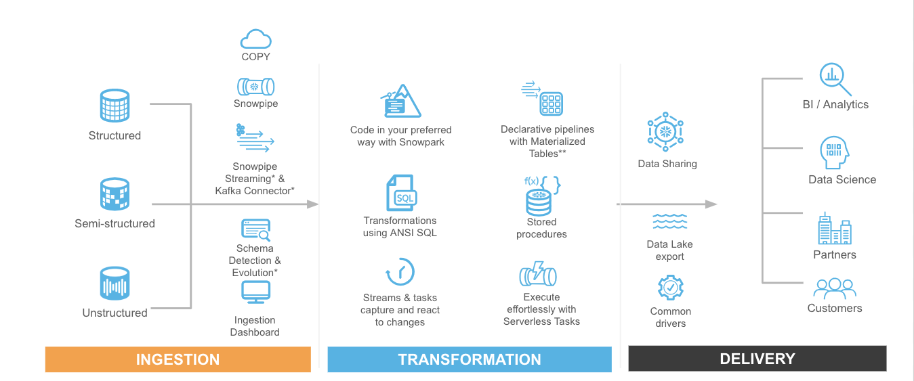
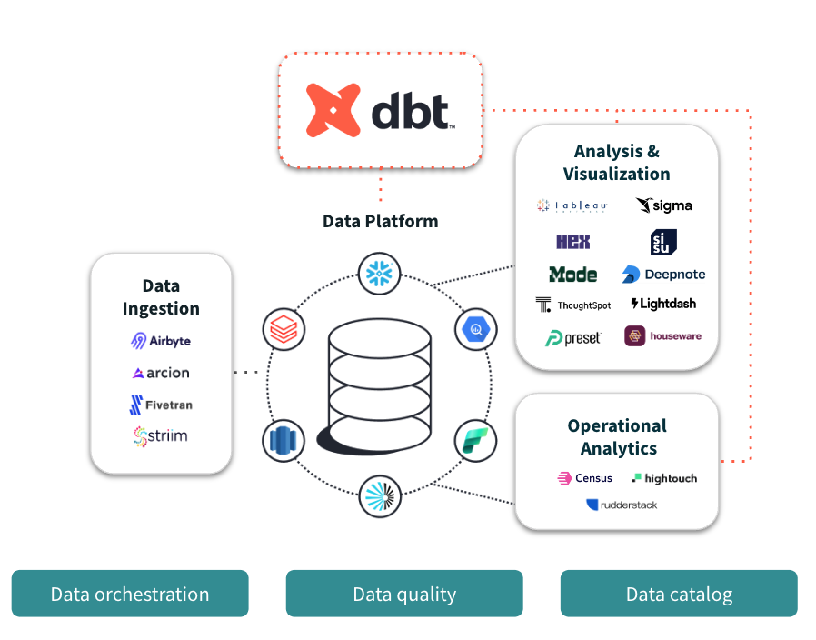
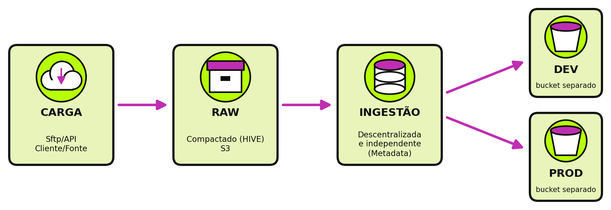
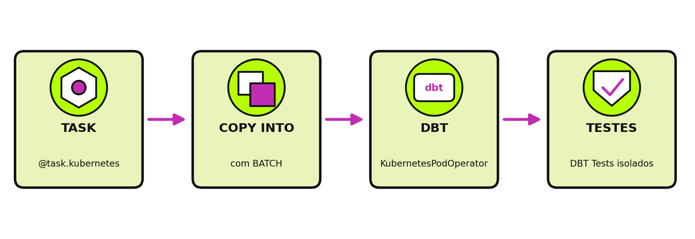
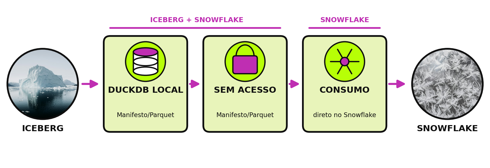

<!-- _class: capa light -->
<!-- _paginate: false -->
<!-- _footer: "" -->

<div class="selo">14 a 19<br>de outubro<br>de 2026<br>{Floripa/SC}</div>

# O Iceberg Foi pro Snowflake

Do monolito com Apache Iceberg ao Snowflake

**Gabu Bellon** · @gabubellon

<!--
- Abertura: título, quem você é e a promessa da palestra em uma frase.
- Combine o ritmo: cerca de 1 minuto por slide e uns 5 minutos para perguntas.
-->

---

<!-- _class: frase light -->

# O design destes slides teve apoio de IA.

O conteúdo técnico é todo do palestrante.
As imagens são de banco de imagens.

<!--
- Transparência rápida: o design teve apoio de IA, o conteúdo técnico é seu.
- Passe em uns 20 segundos.
-->

---

<!-- _class: palestrante light -->


# Gabu Bellon

### Lead Data Engineer · phData · @gabubellon

- Pronomes: Nenhum / Ele / Dele
- Nerd/Geek, Queer, Comunista e pai da Ceci
- Entusiasta de Comunidade de Dados
- Pythonista e Conselheiro da APyB

<!--
- Apresentação curta: cargo, comunidade e Python.
- Deixe o contato para o fim.
-->

---

<!-- _class: light -->

## Uma Jornada em Três Gerações

<div class="jornada">
<div class="geracao"><span class="numero">01</span><div class="logos"></div><h3>Monólito</h3><p>Apache Iceberg</p></div>
<div class="seta">→</div>
<div class="geracao"><span class="numero">02</span><div class="logos"></div><h3>Warehouse</h3><p>Snowflake e dbt</p></div>
<div class="seta">→</div>
<div class="geracao"><span class="numero">03</span><div class="logos"></div><h3>Batch</h3><p>Airflow + Kubernetes</p></div>
</div>

<!--
- Conte as três gerações em ordem: Monólito, Warehouse e Batch.
- Nenhuma substitui a anterior de uma vez: convivem na migração, feed a feed, sem big-bang.
-->

---

<!-- _class: numeros light -->

## A Plataforma de Dados

- **30+** fontes de dados de fornecedores do mercado financeiro
- **50+** DAGs em produção
- **3** gerações de arquitetura convivendo

<!--
- Os três números: 30+ fontes, 50+ DAGs e 3 gerações convivendo.
- A plataforma consolida preços, índices, derivativos e referências do mercado financeiro.
-->

---

<!-- _class: light -->

## Funcionar X Escalabilidade

<div class="versus">
<div class="lado-a">Crescimento</div><div class="disco">X</div><div class="lado-b">Governança e Manutenção</div>
<div class="lado-a">Melhor Arquitetura</div><div class="disco">X</div><div class="lado-b">Arquitetura Que Entrega</div>
<div class="lado-a">Solução Perfeita</div><div class="disco">X</div><div class="lado-b">Solução Necessária</div>
</div>

<!--
- Cada linha é uma tensão do dia a dia: um exemplo curto de cada.
- Ideia central: funcionar hoje não garante escalar amanhã.
-->

---

<!-- _class: secao light -->
<!-- _paginate: false -->
<!-- _footer: "" -->

# _01_ Ferramentas

<!--
- Abre a parte de ferramentas: Airflow, Snowflake, dbt e Iceberg.
- Depois, como acessar um catálogo Iceberg.
-->

---

<!-- _class: cartoes light fig-dir fig-mago -->


## Apache Airflow

1. **O que é** Orquestrador de Rotinas Agendadas (DAG)
2. **Como funciona** Cada fluxo é uma DAG em código Python.
3. **No dia a dia** Permite centralizar a execução de rotinas e pipelines de dados

<!--
- Airflow orquestra rotinas agendadas; cada fluxo é uma DAG em código Python.
- O próximo slide mostra uma DAG pequena.
-->

---

<!-- _class: light -->

## Apache Airflow

```python
from datetime import datetime
from airflow.decorators import dag
from airflow.operators.empty import EmptyOperator
@dag(start_date=datetime(2021, 1, 1),
     schedule="@daily")
def meu_dag():
    a, b, c, d = [
            EmptyOperator(task_id=t) 
            for t in "abcd"
        ]
    a >> [b, c] >> d
meu_dag()
```


<!--
- Uma DAG (grafo acíclico dirigido) reúne tarefas e dependências; aqui vai com o decorador @dag.
- O operador >> define a ordem: a roda antes; b e c depois; d só quando as duas terminam.
- Cada execução cria um DAG Run; schedule="@daily" roda um por dia.
-->

---

<!-- _class: cartoes light fig-esq fig-mago-ola -->


## Snowflake

1. **O que é** Solução de Ambiente de Dados Completa na nuvem
2. **Como organiza** Banco de dados, Ferramentas de Dados (Stream, Acesso)
3. **No dia a dia** Ambiente de disponibilização e análise de dados

<!--
- Snowflake: ambiente de dados completo na nuvem.
- O próximo slide traz o diagrama geral.
-->

---

<!-- _class: light -->

## Snowflake



<!--
- Use o diagrama como visão geral, sem detalhar cada caixa.
-->

---


<!-- _class: cartoes light fig-dir fig-bruxa -->


## dbt

1. **O que é** Ferramenta para transformar dados com SQL dentro do banco.
2. **Como organiza** Cada consulta SQL vira um modelo, em camadas.
3. **No dia a dia** Testes, documentação e histórico do código junto dos modelos.

<!--
- dbt transforma dados com SQL dentro do banco, em modelos e camadas.
- Testes e documentação ficam junto dos modelos.
-->

---

<!-- _class: light -->

## dbt

```yml
version: 2
models:
  - name: pedidos
    description: Pedidos
    columns:
      - name: id
        tests: [unique]
```



<!--
- Um modelo com descrição e um teste de unicidade no id.
- O diagrama ao lado mostra as camadas.
-->

---

<!-- _class: cartoes light fig-esq fig-bruxa -->


## Apache Iceberg

1. **O que é** Formato de tabela para arquivos de dados.
2. **Pra que serve** Traz transação e versão pros arquivos.
3. **No dia a dia** Cada commit vira um snapshot: dá pra voltar no tempo.

<!--
- Iceberg é um formato de tabela para arquivos de dados, não um motor nem um banco.
- Cada commit vira um snapshot: dá pra voltar no tempo.
-->

---

<!-- _class: light -->

## Apache Iceberg


<!--
- Sugestão de analogia: o catálogo organiza e os arquivos guardam os dados.
- Passe rápido: é um slide de imagem.
-->

---

<!-- _class: fluxo-vertical light -->
<!-- _paginate: false -->


## Catálogo e Metadata

1. Catálogo/Metadata
2. Schema/Snapshot
3. Manifest
4. Dados

<!--
- O catálogo guarda só um ponteiro: qual metadata file é o atual de cada tabela.
- Metadata file (schema, snapshots), manifest list, manifest files e, por fim, os arquivos de dados.
-->

---

<!-- _class: light -->
## Histórico de Snapshots

<div class="nota-flutuante dir">
<strong>Snapshots</strong><br>Cada commit vira um snapshot novo: dá pra marcar (tags) e voltar no tempo.
</div>


<!--
- Cada commit vira um snapshot novo na linha do tempo.
- Dá pra marcar snapshots importantes (tags) para auditoria ou retenção.
-->

---

<!-- _class: light -->
## Particionamento

<div class="nota-flutuante dir">
<strong>Particionamento</strong><br>é dinâmico porque é gerenciado diretamente no dado
</div>


<!--
- O particionamento é dinâmico porque é gerenciado diretamente no dado.
- Aponte no diagrama onde a partição aparece.
-->

---

<!-- _class: light logo-br logo-iceberg -->

## Manifest: o Ponteiro pros Dados

```json
{
  "status": 1,
  "snapshot_id": 8744736658442914487,
  "data_file": {
    "file_path": "s3://bucket/data/00000.parquet",
    "partition": {"data_pedido_day": 20468},
    "record_count": 1000
  }
}
```

<!--
- Cada linha do manifest aponta um arquivo de dados (file_path), com métricas como record_count.
- Exemplo simplificado e com valores inventados; o manifest real é Avro, aqui em JSON.
- status: 0 existente, 1 adicionado, 2 removido.
-->

---

<!-- _class: light tabela-compacta -->


## Como Acessar o Catálogo

| Catálogo | Implementação |
|---|---|
| Python | Code (PyIceberg e Polars) |
| Engine | Code e SaaS (Spark, Flink, Trino, DuckDB e Snowflake) |
| REST Catalog | Code ou SaaS (Snowflake, Polaris, Unity Catalog, Tabular) |
| Hive Catalog | Code |
| AWS Glue | SaaS |
| JDBC Catalog | SaaS |
| Nessie Catalog | Code |
| Hadoop Catalog | Code |

<!--
- Visão geral: de Python a engines e serviços gerenciados, quase todos falam com o mesmo catálogo.
- A lista é parcial; a documentação traz mais engines (ver Referências).
- Polaris, Unity Catalog e Tabular implementam o protocolo REST Catalog.
-->

---

<!-- _class: light logo-br logo-python -->

## PyIceberg

```python
from pyiceberg.catalog import load_catalog

catalog = load_catalog(
    "meu", type="rest", uri="https://catalogo.exemplo.com"
)
tabela = catalog.load_table("vendas.pedidos")
df = tabela.scan().to_pandas()
```

<!--
- Exemplo genérico: troque o nome do catálogo, a URI e a tabela pelos seus.
- type="rest" vale para catálogos REST; Glue, Hive e outros usam outro type.
-->

---

<!-- _class: light logo-br logo-python -->

## PyIceberg: Disco Local

```python
from pyiceberg.catalog import load_catalog

catalog = load_catalog(
    "local", type="sql",
    uri="sqlite:///catalogo.db",
    warehouse="file:///dados/warehouse",
)
tabela = catalog.load_table("vendas.pedidos")
```

<!--
- Mesmo código, mas o catálogo é um arquivo SQLite e os dados ficam numa pasta do disco.
- O warehouse usa file://; sem servidor e sem URL.
-->

---

<!-- _class: light logo-br logo-iceberg -->

## Spark

```python
spark = (SparkSession.builder
  .config("spark.sql.catalog.meu",
          "org.apache.iceberg.spark.SparkCatalog")
  .config("spark.sql.catalog.meu.type", "rest")
  .config("spark.sql.catalog.meu.uri", URI)
  .getOrCreate())
spark.sql("SELECT * FROM meu.vendas.pedidos")
```

<!--
- Precisa do JAR iceberg-spark-runtime no classpath da sessão.
- O nome depois de spark.sql.catalog. é o nome do catálogo nas consultas.
-->

---

<!-- _class: light logo-br logo-iceberg -->

## DuckDB

```sql
INSTALL iceberg;
LOAD iceberg;
ATTACH 'warehouse' AS meu (
  TYPE iceberg, ENDPOINT 'https://catalogo.exemplo.com'
);
SELECT * FROM meu.vendas.pedidos;
```

<!--
- Troque o endpoint e o nome do warehouse pelos seus.
- Normalmente precisa de um CREATE SECRET; a sintaxe depende da versão do DuckDB.
-->

---

<!-- _class: light logo-br logo-iceberg -->

## Trino

```properties
# etc/catalog/meu.properties
connector.name=iceberg
iceberg.catalog.type=rest
iceberg.rest-catalog.uri=https://catalogo.exemplo.com
```

```sql
SELECT * FROM meu.vendas.pedidos;
```

<!--
- No Trino o catálogo é um arquivo .properties; o nome do arquivo vira o nome do catálogo.
- Troque a URI pela do seu catálogo REST.
-->

---

<!-- _class: light logo-br logo-snowflake -->

## Snowflake: Catalog Integration

```sql
CREATE CATALOG INTEGRATION meu_catalogo
  CATALOG_SOURCE = ICEBERG_REST
  TABLE_FORMAT = ICEBERG
  CATALOG_NAMESPACE = 'vendas'
  REST_CONFIG = (CATALOG_URI = 'https://exemplo.com/api')
  ENABLED = TRUE;
```

<!--
- Exemplo sem a autenticação (REST_AUTHENTICATION); confira os parâmetros na documentação.
- Depois: CREATE ICEBERG TABLE ... CATALOG = 'meu_catalogo' CATALOG_TABLE_NAME = 'pedidos'.
- O Snowflake lê a tabela; quem a gerencia continua sendo o catálogo externo.
-->

---

<!-- _class: secao light -->
<!-- _paginate: false -->
<!-- _footer: "" -->

# _02_ Monólito Iceberg

<!--
- Volta no tempo: o monólito com Apache Iceberg.
-->

---

<!-- _class: light imagem-centro -->


<!--
- O monólito: um sistema só, em Python, concentrando o fluxo de ponta a ponta.
-->

---

<!-- _class: fluxo light fluxo-logos -->

## Fluxo Legado

1. SFTP/API
2.  Airflow
3.  Builders em Python (INSERT/UPDATE)
4.  Commit no Iceberg

```python
@DataLakeTable(
    dataset="precos",
    name="fechamento",
)
def build(procdate):
    ...
```

<!--
- Airflow dispara o main_*.py; execução manual: python main_.py --procdate YYYYMMDD.
- Os builders em Python registram-se com @DataLakeTable; o commit no Iceberg vira um snapshot.
- FileLock serializa as escritas do Spark.
-->

---

<!-- _class: light -->
<!-- _paginate: false -->

## Catálogo Rígido

<div class="grade-2">
<div class="cartao"><div class="titulo">S3 → LOCAL</div><div class="texto">virtual</div></div>
<div class="cartao"><div class="titulo">UM NÓ</div><div class="texto">PySpark por execução</div></div>
<div class="cartao"><div class="titulo">CAMINHO RÍGIDO</div><div class="texto">no manifesto: /home/xpto/file.parquet</div></div>
<div class="cartao"><div class="titulo">UPDATE</div><div class="texto">em partições</div></div>
</div>

<div class="faixa"><span class="disco">✕</span>ANTI-PATTERN</div>


<!--
- Cada cartão é um motivo do anti-pattern.
- Foque no caminho rígido: o manifesto aponta um caminho local.
-->

---

<!-- _class: secao light -->
<!-- _paginate: false -->
<!-- _footer: "" -->

# _03_ Snowflake e DBT

<!--
- Segunda geração: Snowflake, dbt e o Datapipe.
-->

---

<!-- _class: light logo-br logo-iceberg -->

## Dá pra reutilizar? Volume externo

```sql
CREATE EXTERNAL VOLUME meu_volume
  STORAGE_LOCATIONS = ((
    NAME = 's3_vendas'
    STORAGE_PROVIDER = 'S3'
    STORAGE_BASE_URL = 's3://meu-bucket/vendas/'
    STORAGE_AWS_ROLE_ARN = 'arn:aws:iam::123456789012:role/sf'
  ));
```

<!--
- Primeiro passo no Snowflake: o volume externo aponta o bucket.
- Exemplo genérico: troque os nomes pelos seus.
-->

---

<!-- _class: light logo-br logo-iceberg -->

## Dá pra reutilizar? Tabela Iceberg

```sql
CREATE ICEBERG TABLE pedidos
  EXTERNAL_VOLUME = 'meu_volume'
  CATALOG = 'meu_catalogo'
  METADATA_FILE_PATH = 'pedidos/metadata/v1.metadata.json';

SELECT * FROM pedidos;
```

<!--
- Depois, a tabela Iceberg lê o metadata file do volume.
- O caminho do metadata é fixo no exemplo, o que leva ao próximo slide.
-->

---

<!-- _class: light -->

## Dá pra reutilizar?

<div class="grade-3">
<div class="cartao"><span class="disco preto">1</span><div class="titulo">Caminho Relativo</div><div class="texto">Manifestos rígidos</div></div>
<div class="cartao"><span class="disco preto">2</span><div class="titulo">Catálogo Dinâmico</div><div class="texto">Gerado a cada carga</div></div>
<div class="cartao"><span class="disco preto">3</span><div class="titulo">Volume de Dados</div><div class="texto">Carga histórica</div></div>
</div>

<div class="faixa"><span class="disco">!</span>NÃO FORAM SEGUIDAS BOAS PRÁTICAS DE ARQUITETURA</div>

<!--
- Três motivos que impediram a reutilização direta.
- Feche com a faixa: não foram seguidas boas práticas de arquitetura.
-->

---

<!-- _class: light -->


<!--
- Pausa visual antes da nova arquitetura.
-->

---

<!-- _class: light -->

## Nova Arquitetura

<div class="grade-2">
<div class="cartao com-logo"><div><div class="titulo">Reaproveitamento</div><div class="texto">Dados Raw históricos (local/s3)</div></div></div>
<div class="cartao com-logo"><div><div class="titulo">Framework Novo</div><div class="texto">Airflow K8S + dbt + Snowflake</div></div></div>
</div>

<p class="legenda-trilha">PIPELINE BATCH</p>
<div class="trilha">
<div class="passo">RAW</div><div class="passo">STAGE</div><div class="passo">INTEG</div><div class="passo">PROD</div>
</div>

<!--
- Reaproveitamento dos dados raw históricos (local/s3) em um framework novo.
- Pipeline batch: RAW, STAGE, INTEG e PROD.
-->

---

<!-- _class: light -->

## Ingestão em Lote



<!--
- Mesma ideia do slide anterior, em diagrama.
- A ingestão ainda não conhece o Snowflake.
-->

---

<!-- _class: light -->

## Camadas do dbt


<!--
- Mesma ideia, agora nas camadas do dbt.
- Consumidores só leem publication, nunca RAW diretamente.
-->

---

<!-- _class: light -->

## Orquestração: Airflow + Kubernetes



<!--
- As tags do dbt ligam cada dataset à sua DAG, por exemplo +tag:ice_mft_futures+.
- Mostre onde o Airflow entra e onde o Kubernetes entra.
-->

---

<!-- _class: light -->

## O Iceberg derreteu



<!--
- Versão em diagrama para comparar com os slides anteriores.
- Mostre quais caminhos usam Iceberg + Snowflake e quais só o Snowflake.
-->

---

<!-- _class: secao light -->
<!-- _paginate: false -->
<!-- _footer: "" -->

# _04_ Enxugando Gelo

<!--
- Fechamento: aprendizados e boas práticas.
- Snowflake, dbt e o Datapipe.
-->

---

<!-- _class: light foto-frase -->


## Iceberg é bom

Sem boas práticas,
vira <mark>um monte de gelo</mark>.

<!--
- Arquitetura: Técnica x Negócios.
- Frase para a plateia levar.
-->

---

<!-- _class: light foto-frase -->


## Segurança x Reuso

Governança sem controle
<mark>não escala</mark>.

<!--
- Arquitetura: Técnica x Negócios.
- Governança sem controle não escala.
-->

---

<!-- _class: light foto-frase -->


## Legado x Lenda

Aprender com o passado,
<mark>sem repetir seus erros</mark>.

<!--
- Arquitetura: Técnica x Negócios.
- Aprender com o passado sem repetir os erros.
-->

---

<!-- _class: encerramento light -->
<!-- _paginate: false -->
<!-- _footer: "" -->

# Perguntas?

**Gabu Bellon**
_@gabubellon_
_bllon.co_


Slides

<!--
- Abra para perguntas e mostre o QR code com os slides.
- Para gerar o QR real: uv run scripts/qr.py https://bllon.co (troca img/qr.png).
-->

---

<!-- _class: frase light -->
<!-- _paginate: false -->
<!-- _footer: "" -->

# Obrigado!

<!--
- Agradeça e avise que as Referências e os extras estão logo depois.
- Os extras servem para quem quiser ver mais.
-->

---

<!-- _class: light tabela-compacta referencias -->

## Referências: Iceberg

| Tema | Link |
|---|---|
| Documentação | [iceberg.apache.org/docs/latest](https://iceberg.apache.org/docs/latest/) |
| Especificação | [iceberg.apache.org/spec](https://iceberg.apache.org/spec/) |
| Branches e tags | [iceberg.apache.org/docs/latest/branching](https://iceberg.apache.org/docs/latest/branching/) |
| Engines suportadas | [iceberg.apache.org/multi-engine-support](https://iceberg.apache.org/multi-engine-support/) |
| PyIceberg | [py.iceberg.apache.org](https://py.iceberg.apache.org/) |
| Spark | [iceberg.apache.org/.../spark-getting-started](https://iceberg.apache.org/docs/latest/spark-getting-started/) |
| Trino | [trino.io/docs/current/connector/iceberg](https://trino.io/docs/current/connector/iceberg.html) |
| DuckDB | [duckdb.org/docs/.../iceberg/overview](https://duckdb.org/docs/stable/core_extensions/iceberg/overview) |

<!--
- Links das documentações citadas nos slides de Iceberg e de acesso ao catálogo.
-->

---

<!-- _class: light tabela-compacta referencias -->

## Referências: Plataforma

| Tema | Link |
|---|---|
| Snowflake e Iceberg | [docs.snowflake.com/.../tables-iceberg](https://docs.snowflake.com/en/user-guide/tables-iceberg) |
| CREATE ICEBERG TABLE | [docs.snowflake.com/.../create-iceberg-table-snowflake](https://docs.snowflake.com/en/sql-reference/sql/create-iceberg-table-snowflake) |
| CREATE CATALOG INTEGRATION | [docs.snowflake.com/.../create-catalog-integration](https://docs.snowflake.com/en/sql-reference/sql/create-catalog-integration) |
| CREATE EXTERNAL VOLUME | [docs.snowflake.com/.../create-external-volume](https://docs.snowflake.com/en/sql-reference/sql/create-external-volume) |
| Airflow (DAGs) | [airflow.apache.org/.../2.5.2/.../dags](https://airflow.apache.org/docs/apache-airflow/2.5.2/core-concepts/dags.html) |
| dbt | [docs.getdbt.com](https://docs.getdbt.com/) |
| Polars | [docs.pola.rs](https://docs.pola.rs/) |
| Parquet | [parquet.apache.org/docs](https://parquet.apache.org/docs/) |

<!--
- Documentação de Snowflake, Airflow, dbt, Polars e Parquet usada nos slides.
- Os links também funcionam no HTML e no PDF gerados com make html e make pdf.
-->

---

<!-- _class: light tabela-compacta referencias -->

## Créditos das Imagens

| Imagem | Origem |
|---|---|
| Diagrama da DAG do Airflow | [Documentação do Airflow 2.5.2](https://airflow.apache.org/docs/apache-airflow/2.5.2/core-concepts/dags.html), Apache License 2.0 |
| Diagrama de snapshots e tags | [Documentação do Apache Iceberg](https://iceberg.apache.org/docs/latest/branching/), Apache License 2.0 |
| Fotos | https://unsplash.com/ e https://unsplash.com/ |
| Logos | Apache Airflow, Apache Iceberg, dbt, Snowflake e Python: marcas dos respectivos projetos |

<!--
- Créditos extraídos dos metadados das imagens e da documentação de origem.
- Imagens sem origem nos metadados não aparecem aqui.
-->

---

<!-- _class: secao light -->
<!-- _paginate: false -->
<!-- _footer: "" -->

# _Extra_ Iceberg

<!--
- Slides de apoio sobre catálogos, caso surjam perguntas.
-->

---

<!-- _class: light logo-br logo-iceberg tabela-compacta -->

## Qual Catálogo Usar?

| Catálogo | Prós | Contras | Produção |
|---|---|---|---|
| REST | Padrão aberto, portável | Precisa de um serviço | Recomendado |
| Glue / DynamoDB | Gerenciado na AWS | Preso à AWS | Recomendado (AWS) |
| JDBC | Usa banco já existente | Menos padrão que o REST | Recomendado |
| Nessie | Branch e auditoria | Mais uma peça pra operar | P/ governança |
| Hive | Reaproveita metastore | Prende ao Hive | Ok se já tem Hive |
| Hadoop | Simples, só filesystem | Exige rename atômico | <mark>Não recomendado</mark> |

<!--
- REST Catalog é o protocolo padrão da comunidade Iceberg, por isso costuma ser a escolha mais segura.
- HadoopCatalog exige rename atômico do filesystem: evite em object stores como S3.
-->

---

<!-- _class: secao light -->
<!-- _paginate: false -->
<!-- _footer: "" -->

# _Extra_ Snowflake

<!--
- Slides de apoio: duas formas de ter uma tabela Iceberg no Snowflake.
-->

---

<!-- _class: light -->

## Snowflake: Lendo Iceberg Externo

```sql
CREATE ICEBERG TABLE pedidos_ext
  EXTERNAL_VOLUME = 'meu_volume'
  CATALOG = 'meu_catalogo'
  CATALOG_TABLE_NAME = 'pedidos';

SELECT * FROM pedidos_ext;
```

<div class="nota"><b>Custo:</b> ler de fora pode gerar cobrança de transferência de dados do provedor de nuvem.</div>

<!--
- Os dados continuam no bucket de origem; o Snowflake só lê.
- Custo: além do warehouse, o provedor de nuvem pode cobrar a saída de dados (egress), em geral entre regiões ou nuvens. Confira os preços do seu provedor.
-->

---

<!-- _class: light -->

## Snowflake como Catálogo: Copiando

```sql
CREATE ICEBERG TABLE pedidos
  CATALOG = 'SNOWFLAKE'
  EXTERNAL_VOLUME = 'meu_volume'
  BASE_LOCATION = 'pedidos/'
AS SELECT * FROM pedidos_ext;
```

<div class="nota"><b>Custo:</b> a leitura externa acontece na cópia; depois a tabela é lida no seu volume.</div>

<!--
- CATALOG = 'SNOWFLAKE': o Snowflake gerencia o catálogo e os metadados; os arquivos ficam no seu volume.
- A cópia lê a tabela externa uma vez (vale a nota de custo anterior).
-->

---

<!-- _class: secao light -->
<!-- _paginate: false -->
<!-- _footer: "" -->

# _Extra_ Python + Polars

<!--
- Slides de apoio: tipos, preprocess e Parquet particionado.
-->

---

<!-- _class: light logo-br logo-python-snowflake -->

## Tipos como enumeradores

```python
class PolarsTyping(Enum):
    INT = pl.Int64
    FLOAT = pl.Float64
    TEXT = pl.String
class SnowflakeTyping(Enum):
    INT = "NUMBER(38,0)"
    FLOAT = "FLOAT"
    TEXT = "VARCHAR"
```

<!--
- Mesmo nome de membro nos dois enums: um lado é o tipo no Polars, o outro o tipo no Snowflake.
-->

---

<!-- _class: light logo-br logo-python-snowflake -->

## Uma coluna, dois tipos

```python
Column(
    name_in_file="PRECO",
    name_in_snowflake="preco",
    snowflake_type=SnowflakeTyping.FLOAT,
    polars_type=PolarsTyping.FLOAT,
)
```

<!--
- Cada Column liga o nome no arquivo ao nome no Snowflake e junta os dois tipos.
-->

---

<!-- _class: light logo-br logo-python-snowflake -->

## Preprocess com Polars

```python
tipos = {c.name_in_file: c.polars_type.value for c in COLS}
nomes = {c.name_in_file: c.name_in_snowflake for c in COLS}

(pl.scan_csv(csv, schema_overrides=tipos)
   .rename(nomes)
   .sink_parquet("pedidos.parquet"))
```

<!--
- COLS é a lista de Column do dataset (SCHEMA_BY_DATASET).
- scan_csv é lazy: nada é lido até o sink_parquet, que grava em streaming.
-->

---

<!-- _class: light logo-br logo-python -->

## CSVs em Parquet particionado

```python
(pl.scan_csv("raw/*.csv", schema_overrides=tipos)
   .rename(nomes)
   .with_columns(ano=pl.col("criado_em").dt.year())
   .sink_parquet(
       pl.PartitionByKey("lake/pedidos", by="ano")))
```

<!--
- Resultado no estilo Hive: lake/pedidos/ano=2025/0.parquet, ano=2026/0.parquet.
- PartitionByKey exige um Polars recente; confira a versão antes de mostrar.
-->

---

<!-- _class: light -->

