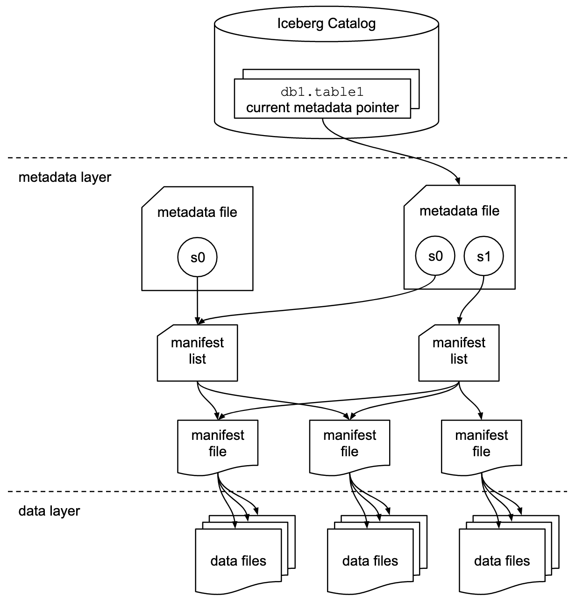

<!-- _class: capa light -->
<!-- _paginate: false -->
<!-- _footer: "" -->

<div class="selo">14 a 19<br>de outubro<br>de 2026<br>{Floripa/SC}</div>

# O Iceberg Foi pro Snowflake

A jornada real de uma migração de dados em produção

**Gabu Bellon** · @gabubellon

<!--
- Adaptado da versão apresentada na Caipyra 2026.
-->

---

<!-- _class: frase light -->

# O design destes slides teve apoio de IA.

O conteúdo técnico é todo do palestrante.

---

<!-- _class: palestrante light -->


# Gabu Bellon

### Lead Data Engineer · phData · @gabubellon

- Pronomes: Nenhum / Ele / Dele
- Nerd/Geek, Comunista e pai da Ceci
- Entusiasta de Comunidade de Dados

<!--
- Trocar img/foto-exemplo.png por uma foto real antes da palestra.
-->

---

<!-- _class: cartoes light -->

## Uma Jornada em Três Gerações

1. **G0 · Lake** Monólito Apache Iceberg, o jeito que tudo começou.
2. **G1 · Warehouse** Snowflake e dbt, via Datapipe.
3. **G2 · Batch** Airflow + Kubernetes, a arquitetura atual.

<!--
- Nenhuma geração substitui a anterior de uma vez: as três convivem durante a migração.
- Migração feed a feed, com corte controlado, sem big-bang.
-->

---

<!-- _class: numeros light -->

## A Plataforma de Dados

- **30+** fontes de dados de fornecedores do mercado financeiro
- **50+** DAGs em produção
- **3** gerações de arquitetura convivendo

<!--
- A plataforma consolida preços, índices, derivativos e referências do mercado financeiro.
-->

---

<!-- _class: destaque light -->

## O que funciona nem sempre é o que escala.

- Crescimento sem governança virou o produto de fato: manutenção
- Cada geração tentou resolver o gargalo que a anterior deixou
- A saída não é um big-bang: é feed a feed, com corte controlado

---

<!-- _class: secao light -->
<!-- _paginate: false -->
<!-- _footer: "" -->

# _00_ Ferramentas

<!--
- Como tudo começou: o monólito Apache Iceberg.
-->

---

<!-- _class: cartoes light fig-dir -->

<style scoped>
section { --logo: url("img/logo_airflow.jpg"); --fig: url("img/sticker-mago.png"); --fig-rot: 9deg; }
</style>

## Apache Airflow

1. **O que é** Ferramenta para agendar e rodar tarefas.
2. **Como funciona** Cada fluxo é uma DAG em código Python.
3. **No dia a dia** Mostra dependências, falhas e logs num só lugar.

---

<!-- _class: cartoes light logo-tl fig-esq -->

<style scoped>
section { --logo: url("img/logo_snowflake.png"); --fig: url("img/sticker-mago-ola.png"); --fig-rot: 8deg; }
</style>

## Snowflake

1. **O que é** Data warehouse gerenciado, na nuvem.
2. **Diferencial** Separa armazenamento e processamento.
3. **No dia a dia** Consultas em SQL, sem cuidar de servidor.

---

<!-- _class: cartoes light logo-br fig-dir -->

<style scoped>
section { --logo: url("img/logo_dbt.png"); --fig: url("img/sticker-witch.png"); --fig-rot: -7deg; }
</style>

## dbt

1. **O que é** Ferramenta para transformar dados com SQL.
2. **Como organiza** Modelos em camadas: staging, integration, publication.
3. **No dia a dia** Traz teste e versionamento pro SQL.

---

<!-- _class: cartoes light logo-tr fig-esq -->

<style scoped>
section { --logo: url("img/logo_apache_iceberg.png"); --fig: url("img/sticker-witch.png"); --fig-rot: -12deg; }
</style>

## Apache Iceberg

1. **O que é** Formato de tabela para arquivos de dados.
2. **Pra que serve** Traz transação e versão pros arquivos.
3. **No dia a dia** Cada commit vira um snapshot: dá pra voltar no tempo.

---

<!-- _class: fluxo-vertical light -->
<!-- _paginate: true -->

## Catálogo e Metadata

1. Catálogo/Metadata
2. Schema/Snapshot
3. Manifest
4. Dados



<!--
- O catálogo guarda só um ponteiro: qual metadata file é o atual de cada tabela.
- Metadata layer: metadata file (schema, snapshots) → manifest list → manifest files.
- Manifest files apontam os arquivos de dados reais (data layer).
- Estrutura descrita na especificação oficial do Apache Iceberg (iceberg.apache.org/spec).
-->

---

<!-- _class: light -->

## Histórico de Snapshots
<div class="nota-flutuante dir">
<strong>Snapshots</strong><br>Cada commit vira um snapshot novo: dá pra marcar (tags) e voltar no tempo.
</div>


<!--
- Cada commit do Iceberg vira um snapshot novo na linha do tempo.
- Dá pra marcar snapshots importantes (tags) e guardar por um tempo, pra auditoria ou retenção.
- Diagrama da documentação oficial do Apache Iceberg (iceberg.apache.org/docs/latest/branching), Apache License 2.0.
-->

---

<!-- _class: light logo-tr -->

<style scoped>
section { --logo: url("img/logo_apache_iceberg.png"); }
</style>

## Como Acessar o Catálogo

| Catálogo | Implementação |
|---|---|
| Python  | Code (PyIceberg e Polars) |
  Engine  | Code and SaaS (Spark, Flink, Trino, DuckDB e Snowflake) |
| REST Catalog | Code ou SaaS (Snowflake,Polaris, Unity Catalog, Tabular |
| Hive Catalog | Code |
| AWS Glue | SaaS |
| JDBC Catalog | SaaS |
| Nessie Catalog | Code |
| Hadoop Catalog | Code |

<!--
- Catálogos suportados pelo Apache Iceberg (iceberg.apache.org/docs/latest).
- HadoopCatalog não implementa rename de tabela e depende de rename atômico do filesystem — por isso é arriscado em object stores como S3.
- "Na mão" é só a infraestrutura: você sobe e mantém o serviço. "Gerenciado" é alguém cuidando disso por você.
- Lista parcial: a documentação lista bem mais engines (iceberg.apache.org/multi-engine-support).
- Polaris, Unity Catalog e Tabular implementam o protocolo REST Catalog da especificação Iceberg.
-->

---

<!-- _class: secao light -->
<!-- _paginate: false -->
<!-- _footer: "" -->

# _01_ Monólito Iceberg

<!--
- Como tudo começou: o monólito Apache Iceberg.
-->

---

<!-- _class: fluxo light logo-br -->

<style scoped>
section { --logo: url("img/logo_apache_iceberg.png"); }
</style>

## Fluxo Legado: do Arquivo ao Lake

1. Arquivo do fornecedor
2. Airflow dispara o job
3. Builders em Python
4. Commit no Iceberg

<!--
- Airflow dispara o main_*.py; execução manual: python main_.py --procdate YYYYMMDD.
- Builders em jgdata/datasets/ transformam os dados.
- initDataset() decide se precisa rodar backfill, via executeBuild().
- O commit no Iceberg vira um snapshot.
-->

---

<!-- _class: light logo-tr -->

<style scoped>
section { --logo: url("img/logo_apache_iceberg.png"); }
</style>

## Builders com Decoradores

```python
@DataLakeTable(
    dataset="precos", name="fechamento"
)
def build(procdate):
    ...
```

<!--
- @DataLakeCache e @DataLakeTable registram o builder no SchemaRegistry.
- FileLock em /var/tmp/iceberg/{table} serializa as escritas do Spark.
-->

---

<!-- _class: duas-colunas light logo-br -->

<style scoped>
section { --logo: url("img/logo_apache_iceberg.png"); }
</style>

## Dois Catálogos

### cache (jg_datacache)

- Chave `dataset.tabela.mk1`
- S3: `{root}/cache/{dataset}/{name}/`

### lake (jg_datalake)

- Chave `{região}.tabela`
- S3: `{root}/lake/{region}/{name}/`

---

<!-- _class: light logo-tr -->

<style scoped>
section { --logo: url("img/logo_apache_iceberg.png"); }
</style>

## Perfil Define o Modo de Escrita

| Perfil | Partição/Freq | Modo |
|---|---|---|
| Série diária | date/daily | append |
| Snapshot/SCD | blob/latest | overwrite_all |
| Reenvio de arquivo | — | overwrite_file |
| Idempotente | — | upsert + joinkey |

<!--
- Cada dataset é descrito num TOML em conf/datasets/*.toml.
-->

---

<!-- _class: secao light -->
<!-- _paginate: false -->
<!-- _footer: "" -->

# _02_ Snowflake e dbt

<!--
- Snowflake, dbt e o Datapipe.
-->

---

<!-- _class: duas-colunas light -->

<style scoped>
section { --logo: url("img/logo_snowflake.png"); }
</style>

## Datapipe: Config em YAML

### Um arquivo por feed

- `.datapipe.yaml` descreve `raw_data` (S3 + `$DATE`)
- `table_map`: regex → tabela RAW, formato, colunas

### Sem builder Python

- Mapeamento por posição de coluna
- `RAW` vira a única fonte da verdade bruta

---

<!-- _class: fluxo light logo-tr -->

<style scoped>
section { --logo: url("img/logo_snowflake.png"); }
</style>

## Pipeline de Carga v1

1. `pipeline_rawdata.py` descobre arquivos e envia ao S3
2. `pipeline_sf_copy.py` roda o COPY INTO
3. Carrega em `VENDOR_RAW` com metadados automáticos
4. DAG `jgetl-dbt-*` orquestra tudo via SSH

<!--
- Metadados automáticos: filename e start_scan_time.
- Um pool_dbt limita a concorrência das cargas.
-->

---

<!-- _class: light logo-br -->

<style scoped>
section { --logo: url("img/logo_dbt.png"); }
</style>

## Camadas do dbt

| Camada | Prefixo | O que faz |
|---|---|---|
| Staging | `stage/raw_*` | Limpeza e casts |
| Integration | `integration/int_*` | Regras de negócio em SQL |
| Publication | `publication/pub_*` | Views para quem consome |

<!--
- Consumidores só leem publication, nunca RAW diretamente.
- sources/*.yml liga os models às tabelas RAW.
-->

---

<!-- _class: secao light -->
<!-- _paginate: false -->
<!-- _footer: "" -->

# _03_ G2 · dp_batch Atual

<!--
- dp_batch, a arquitetura atual.
-->

---

<!-- _class: fluxo light -->

## Ingestão no dp_batch

1. `sftp_ingest` traz o arquivo do fornecedor
2. Grava em S3 Raw, particionado ao estilo Hive
3. `MetadataService` registra ingest_id e idempotência
4. Buckets separados para dev e prod

<!--
- A ingestão ainda não conhece o Snowflake.
-->

---

<!-- _class: light logo-tr -->

<style scoped>
section { --logo: url("img/logo_python.png"); }
</style>

## Preprocess com Polars

```python
Column(
    name_in_file="PRECO",
    name_in_snowflake="preco",
    snowflake_type=SnowflakeTyping.FLOAT,
    polars_type=PolarsTyping.FLOAT,
)
```

<!--
- CsvReader (lazy) → transforma → Parquet.
- orchestrate_preprocess usa SCHEMA_BY_DATASET para tipar cada coluna.
-->

---

<!-- _class: fluxo light -->

<style scoped>
section { --logo: url("img/logo_airflow.jpg"); }
</style>

## Orquestração: Airflow + Kubernetes

1. `@task.kubernetes` roda ingest/preprocess em pods isolados
2. COPY INTO grava no schema `*_DP_BATCH`
3. `KubernetesPodOperator` roda `dbt run --select +tag:dataset+`
4. `task_factory.make_validation_task` garante testes com Elementary

<!--
- As tags do dbt ligam cada dataset à sua DAG, ex. +tag:ice_mft_futures+.
-->

---

<!-- _class: encerramento light -->
<!-- _paginate: false -->
<!-- _footer: "" -->

# Perguntas?

**Gabu Bellon**
_@gabubellon_
_bllon.co_


gabubellon.me · loucuradevaneia.com

<!--
- Gerar o QR code real: uv run scripts/qr.py https://bllon.co (troca img/qr.png).
-->

---

<!-- _class: secao light -->
<!-- _paginate: false -->
<!-- _footer: "" -->

# Extra

<!--
- Slides de apoio, caso dê tempo ou surjam perguntas sobre catálogos.
-->

---

<!-- _class: light logo-tr -->

<style scoped>
section { --logo: url("img/logo_apache_iceberg.png"); }
table { width: 100%; table-layout: fixed; font-size: 22px; }
th, td { padding: 6px 10px; word-wrap: break-word; }
</style>

## Qual Catálogo Usar?

| Catálogo | Prós | Contras | Produção |
|---|---|---|---|
| REST | Padrão aberto, portável | Precisa de um serviço | Recomendado |
| Glue / DynamoDB | Gerenciado na AWS | Preso à AWS | Recomendado (AWS) |
| JDBC | Usa banco já existente | Menos padrão que o REST | Recomendado |
| Nessie | Branch e auditoria | Mais uma peça pra operar | P/ governança |
| Hive | Reaproveita metastore | Prende ao Hive | Ok se já tem Hive |
| Hadoop | Simples, só filesystem | Exige rename atômico | <mark>Não recomendado</mark> |

<!--
- HadoopCatalog não suporta rename de tabela e exige rename atômico do filesystem: evite em object stores como S3.
- REST Catalog é hoje o protocolo padrão da comunidade Iceberg, por isso costuma ser a escolha mais segura.
-->

---

<!-- _class: figurinhas light -->
<!-- _paginate: false -->
<!-- _footer: "" -->

## Figurinhas

### Dazumbanho! Chegasse ao fim, ixtepô!

    

 <span class="circulo">olha aqui</span> <mark>marca-texto</mark>  

Identidade visual de Ana Terhorst, [anaterhorstdesign.com](https://anaterhorstdesign.com). Valeu, Ana!
</content>
